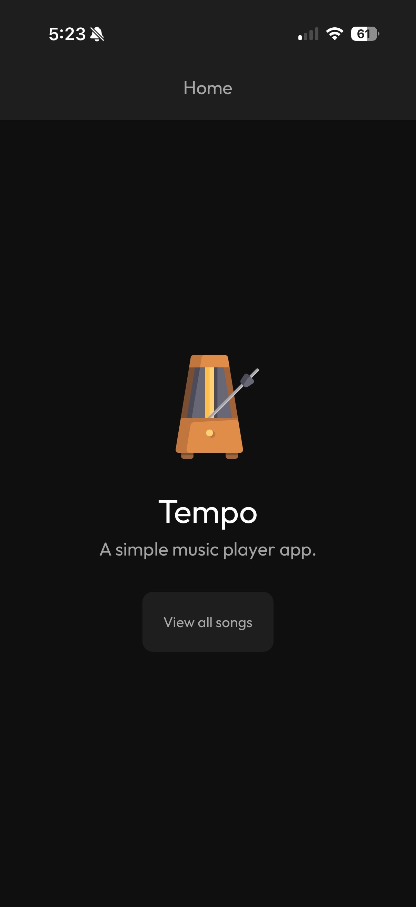
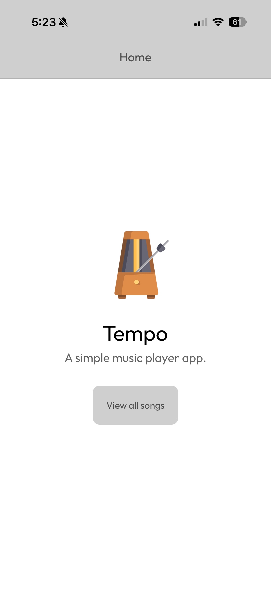
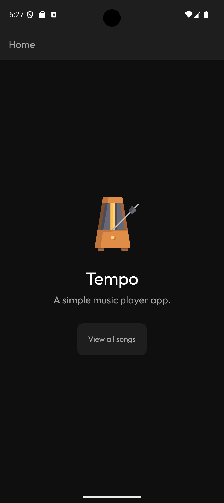
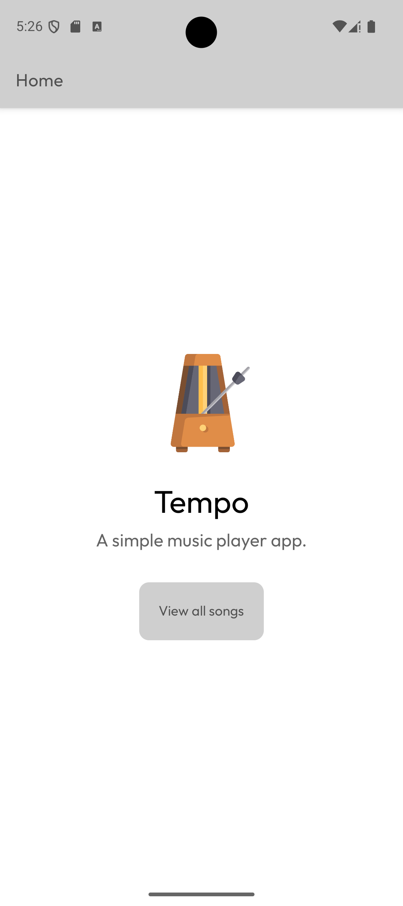

# Tempo: A Music Player App
Tempo is an in-progress offline music player app for iOS and Android, built using React Native, Expo, and JavaScript. Planned functionality includes a home tab displaying user-created playlists and recently played songs, a library tab with a list of all uploaded music files, a pop-up window to upload files into the library, automatic light/dark mode detection, and a minimizable music player with album art and play/pause functionality.

# Beta Designs for iOS (Light/Dark Modes):

# Beta Designs for Android (Light/Dark Modes):

